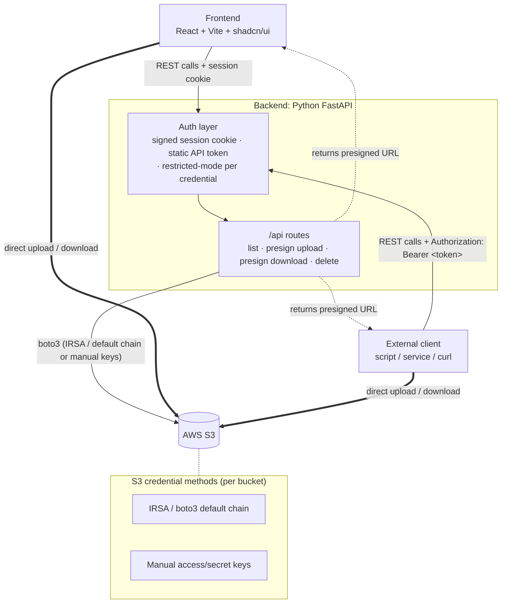

# S3 Explorer

A modern, fast, and secure web application for browsing and managing AWS S3 buckets. Built with a premium glassmorphism UI and a robust Python API, S3 Explorer allows you to safely configure and access multiple S3 buckets without requiring global `s3:ListAllMyBuckets` IAM permissions.

## Features

- **Multi-Bucket Support with Scoped Credentials:** Configure multiple buckets easily using your `.env` file. Each bucket can have its own isolated IAM credentials (either manual Access Keys or inherited seamlessly via Boto3's default provider chain). 
- **No Global Permissions Needed:** Because buckets are explicitly configured and selectable via a UI dropdown, the application never needs to call `ListBuckets` globally.
- **Direct S3 Uploads/Downloads:** The backend generates secure Presigned URLs. The frontend uses these to stream file uploads and downloads directly to/from AWS S3, bypassing the backend server to save bandwidth and improve performance. Drag-and-drop onto the file table works as well as the upload button.
- **Get Upload Link:** Alongside the normal browser upload, any user can generate a manual presigned `PUT` link (with a ready-to-run `curl` command) to hand off or run themselves — available in both restricted and unrestricted mode.
- **Search, Sort & File-Type Icons:** Filter the current folder by name, click a column header to sort by name/date/size, and files show an icon based on their extension.
- **Toasts & Confirm Dialogs:** Upload/download/delete feedback is shown via toast notifications, and deletes require confirmation in a proper dialog (no native browser popups).
- **Multi-Profile Login:** Configure more than one login password, each with its own restricted-mode access level baked into its session — e.g. one full-access login and one restricted-only login on the same deployment.
- **Static API Tokens:** External scripts and services can call the same protected `/api` routes with an `Authorization: Bearer <token>` header instead of a browser login — each token carrying its own restricted-mode.
- **Modern Tech Stack:**
  - **Frontend:** React, Vite, TypeScript, TanStack Query, and **shadcn/ui** components.
  - **Backend:** Python, FastAPI, and `boto3` (managed via `uv`).

## Project Structure

- `/src` - The FastAPI Python backend code.
- `/frontend` - The React SPA frontend.
- `pyproject.toml` - Python dependency management for `uv`.
- `Makefile` - Helper commands for running the app.

---

## Configuration (`.env`)

The application supports multiple buckets dynamically configured through your `.env` file by prefixing variables with `BUCKET_{INDEX}_`.

Create a `.env` file at the root of the project:

```env
# Bucket 1: Manual Authentication
BUCKET_1_ID=dev-bucket
BUCKET_1_NAME=my-dev-bucket-123
BUCKET_1_REGION=us-east-1
BUCKET_1_AUTH_TYPE=manual
BUCKET_1_ACCESS_KEY=YOUR_ACCESS_KEY
BUCKET_1_SECRET_KEY=YOUR_SECRET_KEY

# Bucket 2: IRSA / Default Boto3 Credential Chain
BUCKET_2_ID=prod-bucket
BUCKET_2_NAME=my-prod-bucket-456
BUCKET_2_REGION=us-west-2
BUCKET_2_AUTH_TYPE=irsa
```

### Note on Authentication (`auth_type=irsa`):
When `auth_type` is set to `irsa` (or anything other than `manual`), the backend does not require explicitly passing `access_key` or `secret_key`. Instead, it natively hands off authentication to **boto3's Default Credential Provider Chain**. Boto3 will automatically search for and use credentials in this order:
1. Environment Variables (`AWS_ACCESS_KEY_ID`, `AWS_SECRET_ACCESS_KEY`)
2. Shared Credentials File (`~/.aws/credentials`)
3. IAM Roles for Service Accounts (IRSA on Kubernetes/EKS via `AWS_ROLE_ARN`)
4. EC2/ECS Instance Metadata

This makes it extremely flexible for both local development and secure cloud deployments.

### Other Environment Variables

| Variable | Default | Description |
|---|---|---|
| `CORS_ORIGINS` | `["*"]` | Origins allowed to call the API. Only matters when the frontend is served from a different origin than the backend (e.g. running `make dev-frontend` separately) — set this to your frontend's URL in that case. |
| `RESTRICTED_MODE` | `false` | Global, app-wide safety mode (applies to every configured bucket). Used as a fallback when no login profiles are configured, or when auth is off entirely. See below. |
| `AUTH_PASSWORD` | unset | Enables the login page with a single shared password using `RESTRICTED_MODE`. Ignored if any `AUTH_PROFILE_N_PASSWORD` is set. See below. |
| `AUTH_PROFILE_{N}_PASSWORD` / `AUTH_PROFILE_{N}_RESTRICTED_MODE` | unset | Multiple login profiles, each with its own password and restricted-mode flag. See below. |
| `API_TOKEN_{N}_VALUE` / `API_TOKEN_{N}_RESTRICTED_MODE` | unset | Static bearer tokens for external/programmatic API access (`Authorization: Bearer <token>`), no session cookie needed. Each token carries its own restricted-mode. `API_TOKEN` (no index) works as a single-token fallback. See below. |
| `SESSION_SECRET` | random per process start | Signs the session cookie. See below. |
| `SESSION_SECURE_COOKIE` | `true` | Marks the session cookie `Secure` (HTTPS-only). Set to `false` for local HTTP-only development. |

### Restricted Mode

Set `RESTRICTED_MODE=true` (globally, or per login profile — see below) to lock that session down to a read-mostly workflow:

- **Delete is disabled.** The delete button is hidden in the UI, and the backend rejects `DELETE /api/buckets/{id}/objects` with `403` regardless of what the frontend sends.
- **Download works as normal** (direct presigned-URL download).
- **Upload never happens through the browser.** Dropping a file onto the table, or clicking the plain "Upload" button, isn't available — the only way to get a file in is "Get upload link" (see below), which the user runs themselves via `curl`. The backend and browser never see the file's bytes.

This is useful for environments where you want people to be able to browse/fetch objects and hand out one-off upload links, without giving the web app itself the ability to delete data or move file bytes through the browser.

### Get Upload Link

The "Get upload link" button generates a presigned `PUT` URL and shows it in a popup with a ready-to-run `curl` command (with a copy-to-clipboard button) — the user runs the command themselves to push the file to S3. Unlike the rest of restricted mode, **this is always available**, in both restricted and unrestricted sessions: it sits next to the normal drag-and-drop/"Upload" button when unrestricted, and is the only upload path when restricted.

The generated command includes a `Content-Type` header, guessed from the key's extension:

```bash
curl -H "Content-Type: image/png" --upload-file "/path/to/photo.png" "<presigned-url>"
```

That header matters: `curl --upload-file` sends no `Content-Type` of its own, and S3 never infers one from the key, so dropping it stores the object as `binary/octet-stream`. `Content-Type` is deliberately left out of the URL signature (only `host` is signed), so the header can be changed — or omitted — without invalidating the link.

### API Tokens (external / programmatic access)

The login flow above is built for a browser: POST a password to `/api/auth/login`, get an `HttpOnly` session cookie, send it back on every call. A script or another service can't use that comfortably.

Set one or more `API_TOKEN_{N}_VALUE` (each with an optional `API_TOKEN_{N}_RESTRICTED_MODE`, default `false`) to allow callers to authenticate with a header instead:

```env
API_TOKEN_1_VALUE=<long-random-string>
API_TOKEN_1_RESTRICTED_MODE=false

API_TOKEN_2_VALUE=<another-long-random-string>
API_TOKEN_2_RESTRICTED_MODE=true
```

Generate values with `openssl rand -hex 32`. `API_TOKEN` (no index) is accepted as a single-token fallback using the global `RESTRICTED_MODE`.

Every protected `/api` route then also accepts:

```
Authorization: Bearer <token>
```

The token's own `restricted_mode` governs that request exactly like a login profile's does — a restricted token gets a presigned `PUT` URL from the upload endpoint and is rejected (`403`) by delete, regardless of the global `RESTRICTED_MODE`.

Example — get a presigned upload URL and push a file, no cookie anywhere:

```bash
BASE=https://your-deployment.example.com
TOKEN=<your-api-token>

RESP=$(curl -sS -X POST "$BASE/api/buckets/dev-bucket/upload-url" \
  -H "Authorization: Bearer $TOKEN" \
  -H "Content-Type: application/json" \
  -d '{"key": "reports/2026-q1.pdf", "manual": true}')

URL=$(echo "$RESP" | jq -r .url)
CT=$(echo "$RESP" | jq -r .content_type)

curl -sS -H "Content-Type: $CT" --upload-file ./2026-q1.pdf "$URL"
```

Notes:

- Always send `"manual": true` in the upload-url body. Without it, an unrestricted token gets a presigned **POST** (a `url` + `fields` form) instead of a plain PUT URL, and the `curl --upload-file` above won't work against it. A restricted token always gets the PUT URL regardless.
- Comparison is constant-time and every configured token is checked (no early exit), same as passwords. Tokens are never logged.
- Both credential types can be configured at once. Per request, a valid session cookie is tried first, then the `Authorization` header.
- Configuring **only** API tokens (no password) still locks down every `/api` route — but a deployment that serves the web UI must also set a login password, since the UI can't send a `Bearer` header.
- Browsers never attach an `Authorization` header on their own, so this adds no CSRF surface beyond what the wildcard-CORS note above already covers.

### Login (`AUTH_PASSWORD` / multi-profile)

Set `AUTH_PASSWORD` (single shared password) or one or more `AUTH_PROFILE_{N}_PASSWORD` variables to require a password before the app (and every `/api` route except `/api/health` and `/api/auth/*`) becomes usable. Leaving both unset disables login entirely — the app behaves exactly as before.

**Multiple profiles**, each with its own independent `restricted_mode`, let you run one deployment with different access levels per password — e.g. a full-access login and a restricted-only login side by side:

```env
AUTH_PROFILE_1_PASSWORD=full-access-password
AUTH_PROFILE_1_RESTRICTED_MODE=false

AUTH_PROFILE_2_PASSWORD=restricted-password
AUTH_PROFILE_2_RESTRICTED_MODE=true
```

Whichever password is used to log in determines that session's `restricted_mode` — it's signed into the session cookie at login time, not read from the global `RESTRICTED_MODE` on every request, so one profile's access level can't leak into another's. `AUTH_PASSWORD` still works as a single-profile fallback (using the global `RESTRICTED_MODE`) when no `AUTH_PROFILE_{N}_PASSWORD` is set — but is ignored entirely once any profile is configured (they don't stack).

Auth itself is intentionally simple (shared passwords, no usernames/accounts) but not naive about it:
- Passwords are compared with a constant-time comparison, not `==` (avoids timing side-channels), and every configured profile is checked (no early exit) so response time doesn't hint at which profile it's checked against.
- A successful login sets an `HttpOnly`, `SameSite=Lax`, and (by default) `Secure` session cookie — never readable from JS, and the backend never stores the password or session state server-side; the cookie itself is an HMAC-signed, expiring token (`SESSION_SECRET` is the signing key) carrying only an expiry and the profile's `restricted_mode`.
- Failed login attempts are rate-limited (5 per minute per client IP) to slow down brute-forcing.
- Every protected endpoint re-validates the session server-side — hiding UI elements is not the enforcement mechanism.

**`SESSION_SECRET` matters if you run more than one backend replica** (e.g. multiple pods behind a load balancer): each process generates its own random secret by default, so a cookie signed by replica A won't validate on replica B, and users will get randomly bounced back to the login page depending on which pod handles the request. Set `SESSION_SECRET` explicitly (a long random string) in any multi-replica deployment, and also set it if you want sessions to survive a restart.

---

## Getting Started (Local Development)

We use a `Makefile` to simplify running the application.

### Prerequisites
- Node.js (for the frontend)
- Python 3.11+
- [`uv`](https://docs.astral.sh/uv/getting-started/installation/) (Fast Python package manager)

### 1. Install Dependencies
```bash
# Creates a virtual environment, installs backend and frontend dependencies
make install
```

### 2. Run the Servers

**Terminal 1 (Backend):**
```bash
make dev-backend
```
*The backend API will be available at `http://localhost:8000`*

**Terminal 2 (Frontend):**
```bash
make dev-frontend
```
*The frontend application will be available at `http://localhost:5173`*

The frontend calls a relative `/api` path; Vite's dev server proxies that to the backend on `http://localhost:8000` (see `frontend/vite.config.ts`), and in production the backend serves the built frontend from the same origin. No hardcoded backend URL to update when deploying elsewhere.

### Health Check

`GET /api/health` returns `{"status": "ok", "buckets_configured": <n>}` — useful for container/orchestrator liveness probes.

---

## Docker Deployment

The project includes a multi-stage Dockerfile that builds the Vite frontend and bundles it directly with the FastAPI backend into a single container. The backend handles serving the frontend's static assets.

```bash
# Build the fullstack image
make docker-build

# Run the container (make sure your .env is populated)
make docker-run
```

The fully contained application will be accessible at `http://localhost:8000`.

---

## Kubernetes / OpenShift (Helm)

A Helm chart is in [`helm/`](helm/). It deploys the same single-container image,
with app config injected as env vars from a `ConfigMap` (non-secret: buckets,
regions, `RESTRICTED_MODE`) and a `Secret` (passwords, API tokens,
`SESSION_SECRET`, manual bucket keys).

```bash
helm upgrade --install s3-explorer ./helm \
  -n s3-explorer --create-namespace \
  -f ./s3-explorer.secrets.yaml
```

Secret values go in a git-ignored override file passed with `-f`, **never** in
`values.yaml`. Full instructions, parameter table, IRSA and secret-rotation
notes: [`helm/README.md`](helm/README.md).

---

## Architecture Diagram



**Flow:** every request carries a credential — a browser sends its signed session cookie, an external caller sends `Authorization: Bearer <token>`. The auth layer resolves it to a principal (with that credential's own restricted-mode) before any route runs. Routes never move file bytes: they hand back a presigned S3 URL and the client uploads/downloads straight to S3. The backend talks to S3 with per-bucket credentials (IRSA/boto3 default chain, or manual keys).
