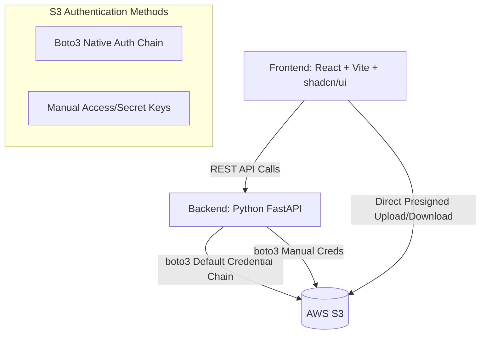

# S3 Explorer

A modern, fast, and secure web application for browsing and managing AWS S3 buckets. Built with a premium glassmorphism UI and a robust Python API, S3 Explorer allows you to safely configure and access multiple S3 buckets without requiring global `s3:ListAllMyBuckets` IAM permissions.

## Features

- **Multi-Bucket Support with Scoped Credentials:** Configure multiple buckets easily using your `.env` file. Each bucket can have its own isolated IAM credentials (either manual Access Keys or inherited seamlessly via Boto3's default provider chain). 
- **No Global Permissions Needed:** Because buckets are explicitly configured and selectable via a UI dropdown, the application never needs to call `ListBuckets` globally.
- **Direct S3 Uploads/Downloads:** The backend generates secure Presigned URLs. The frontend uses these to stream file uploads and downloads directly to/from AWS S3, bypassing the backend server to save bandwidth and improve performance. Drag-and-drop onto the file table works as well as the upload button.
- **Search, Sort & File-Type Icons:** Filter the current folder by name, click a column header to sort by name/date/size, and files show an icon based on their extension.
- **Toasts & Confirm Dialogs:** Upload/download/delete feedback is shown via toast notifications, and deletes require confirmation in a proper dialog (no native browser popups).
- **Modern Tech Stack:**
  - **Frontend:** React, Vite, TypeScript, TanStack Query, and **shadcn/ui** components.
  - **Backend:** Python, FastAPI, and `boto3` (managed via `uv`).

## Project Structure

- `/src` - The FastAPI Python backend code.
- `/frontend` - The React SPA frontend.
- `pyproject.toml` - Python dependency management for `uv`.
- `Makefile` - Helper commands for running the app.

---

## Configuration (`.env`)

The application supports multiple buckets dynamically configured through your `.env` file by prefixing variables with `BUCKET_{INDEX}_`.

Create a `.env` file at the root of the project:

```env
# Bucket 1: Manual Authentication
BUCKET_1_ID=dev-bucket
BUCKET_1_NAME=my-dev-bucket-123
BUCKET_1_REGION=us-east-1
BUCKET_1_AUTH_TYPE=manual
BUCKET_1_ACCESS_KEY=YOUR_ACCESS_KEY
BUCKET_1_SECRET_KEY=YOUR_SECRET_KEY

# Bucket 2: IRSA / Default Boto3 Credential Chain
BUCKET_2_ID=prod-bucket
BUCKET_2_NAME=my-prod-bucket-456
BUCKET_2_REGION=us-west-2
BUCKET_2_AUTH_TYPE=irsa
```

### Note on Authentication (`auth_type=irsa`):
When `auth_type` is set to `irsa` (or anything other than `manual`), the backend does not require explicitly passing `access_key` or `secret_key`. Instead, it natively hands off authentication to **boto3's Default Credential Provider Chain**. Boto3 will automatically search for and use credentials in this order:
1. Environment Variables (`AWS_ACCESS_KEY_ID`, `AWS_SECRET_ACCESS_KEY`)
2. Shared Credentials File (`~/.aws/credentials`)
3. IAM Roles for Service Accounts (IRSA on Kubernetes/EKS via `AWS_ROLE_ARN`)
4. EC2/ECS Instance Metadata

This makes it extremely flexible for both local development and secure cloud deployments.

### Other Environment Variables

| Variable | Default | Description |
|---|---|---|
| `CORS_ORIGINS` | `["*"]` | Origins allowed to call the API. Only matters when the frontend is served from a different origin than the backend (e.g. running `make dev-frontend` separately) — set this to your frontend's URL in that case. |

---

## Getting Started (Local Development)

We use a `Makefile` to simplify running the application.

### Prerequisites
- Node.js (for the frontend)
- Python 3.11+
- [`uv`](https://docs.astral.sh/uv/getting-started/installation/) (Fast Python package manager)

### 1. Install Dependencies
```bash
# Creates a virtual environment, installs backend and frontend dependencies
make install
```

### 2. Run the Servers

**Terminal 1 (Backend):**
```bash
make dev-backend
```
*The backend API will be available at `http://localhost:8000`*

**Terminal 2 (Frontend):**
```bash
make dev-frontend
```
*The frontend application will be available at `http://localhost:5173`*

The frontend calls a relative `/api` path; Vite's dev server proxies that to the backend on `http://localhost:8000` (see `frontend/vite.config.ts`), and in production the backend serves the built frontend from the same origin. No hardcoded backend URL to update when deploying elsewhere.

### Health Check

`GET /api/health` returns `{"status": "ok", "buckets_configured": <n>}` — useful for container/orchestrator liveness probes.

---

## Docker Deployment

The project includes a multi-stage Dockerfile that builds the Vite frontend and bundles it directly with the FastAPI backend into a single container. The backend handles serving the frontend's static assets.

```bash
# Build the fullstack image
make docker-build

# Run the container (make sure your .env is populated)
make docker-run
```

The fully contained application will be accessible at `http://localhost:8000`.

---

## Architecture Diagram


